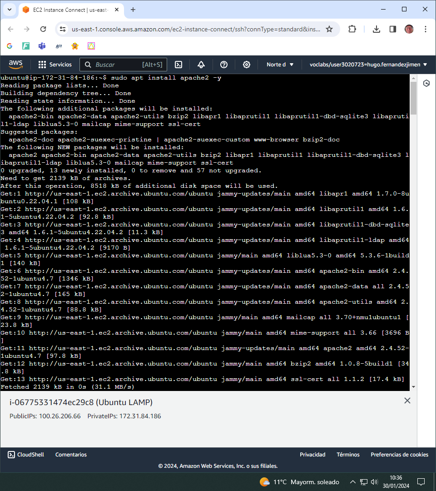

# Readme Actividad 1.3_LAMP:

## Instalación
### Usamos el comando apt update para actualizar la lista de paquetes disponibles en los repositorios de software:
  
### Instalamos el servicio apache2 con el siguiente comando:
  
### Procedemos a instalar el PHP:
  
### Configuramos el default.conf:

### Comprobamos mediante el navegador si nos conecta a la maquina:  
   
### Comprobamos el info.php:
  
### Instalamos MARIADB:
  
### Instalamos PHPMYADMIN:
   
### Y en la instalación señalamos que queremos usar apache2 con el PHPMYADMIN:
 
### Cambiamos la contraseña de MARIADB:
  
### ComprobamoS que PHPMYADMIN FUNCIONA ADECUADAMENTE:
  
